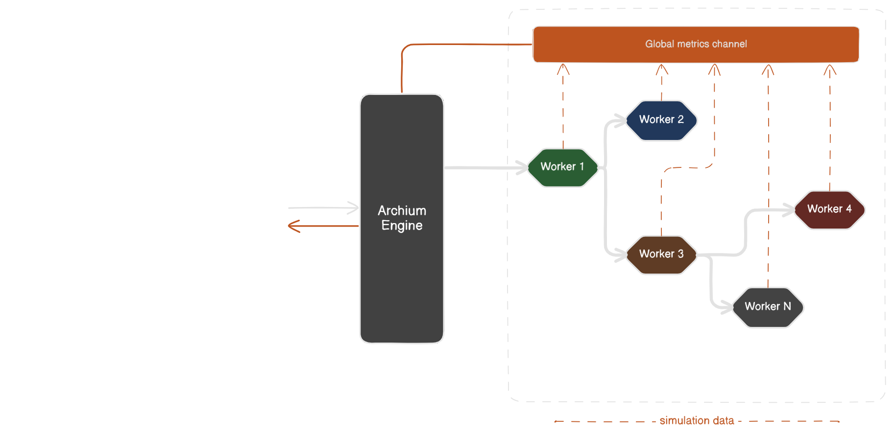

# Archium - Server

In order to understand how the Archium platform works on behind, we need to define some key concepts before.

### Diagram

A Diagram represents a complete system architecture simulation. A Diagram is composed of interconnected **Workers** that define service interactions under the control of the **Engine**. A single Diagram can model a cloud infrastructure, a microservices ecosystem, or any distributed system, allowing users to analyze its performance, behavior, and cost estimations.

Running a Diagram triggers a real-time simulation, processing defined constraints like latency, failure rates, and request load.

### Engine

The Engine is the central component responsible for executing **Diagrams**. It simulates system behavior based on the defined service properties, processes event flow, and aggregates metrics to send to the frontend.

- Manages Workers and processes their interactions.
- Handles event propagation and workload distribution.
- Collects simulation data and sends metrics to the frontend.

### Worker

A worker represents an individual service within a **Diagram**. Each worker has custom properties:

- Latency (expected delay in processing requests).
- Failure rate (probability of errors occurring).
- Request handling capacity (simulated throughput).
- Database size (if applicable, estimated storage and query operations).

## Analysis

Each service instance is independent, with its own properties like latency, failure rate, and throughput. Therefore, each service definition is easy to modify, test, and extend without breaking everything.

The Engine acts as an orchestrator, collecting events from services and sending aggregated data to the frontend.

Services communicate with the Engine via a global metrics channel, reducing memory overhead and making WebSocket integration straightforward.

WebSockets (or another streaming method) are handled by the Engine, ensuring controlled and batched updates to the frontend.

Each service runs as a separate Goroutine, making everything concurrent and highly scalable.

## Implementation plan

1. Each service runs as a Goroutine and sends metrics to a global metrics channel.
2. The Engine listens to this single channel, collects the data, and batches it.
3. Every X milliseconds, the Engine sends a batch update to the frontend via WebSocket.

## Benefits

- **Concurrent**. Every service runs independently in Goroutines.

- **Decoupled**. Services don't know about each other, only the Engine.

- **Efficient communication**. Using a single global channel avoids unnecessary complexity.

- **Optimized**. Engine batches and sends controlled updates.
